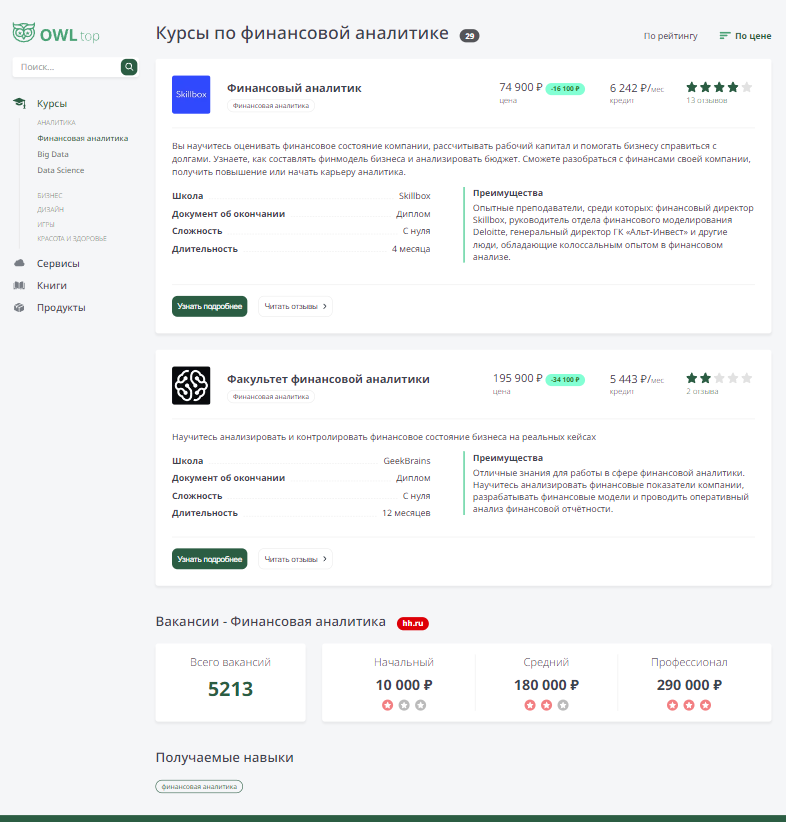

### next-top-app

#### О проекте
 
 Приложение с информацией о курсах. Можно посмотреть информацию о курсах, посмотреть отзывы, написать и отправить свой отзыв.
 В приложении настроен eslint, stylelint, prettier, husky.
 Роутинг настроен без App Router. 
 Для управления состоянием используется React Contex.
 В верстке используется grid. Работа с формой осуществляется через react hook form. 
 Проводилась работа над доступностью (цветовая, доступность меню, форм с клавиатуры, доступность сортировки)

#### Технологии

  
  
  
  
  

#### Установка и запуск приложения

<b>Развернуть</b>

Клонировать репозиторий:

    git clone https://github.com/Mariyazakharova73/next-top-app.git

Установить зависимости:

    npm install

Запустить проект:

    npm run dev

<!-- [Ссылка на проект next-top-app](https://mariyazakharova73.github.io/)
-->

  

 

